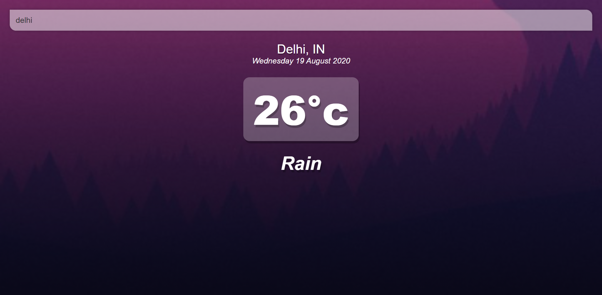
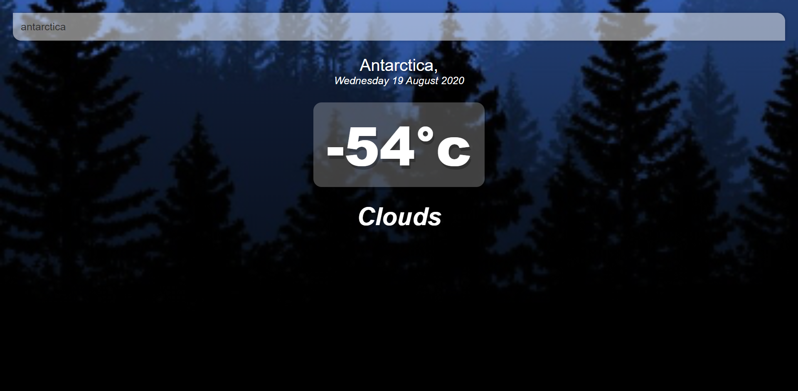

# vue-weather

A Weather App made by using VueJS and openweather API. Shows Teampreature in °c (dgree celcius) with weather condtion underneath it.

## Screen-Shot

### Warmer climate


### Colder climate (less than 16°c)


## Project setup
```
npm install
```

### Compiles and hot-reloads for development
```
npm run serve
```

### Compiles and minifies for production
```
npm run build
```

### Lints and fixes files
```
npm run lint
```

### Customize configuration
See [Configuration Reference](https://cli.vuejs.org/config/).
